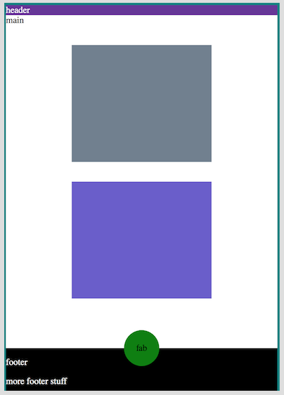

# City Match

Find your city.

# Designer's Log

The Starlight terrace at the Oasis is modestly busy. It's Saturday night which means the music could be rock, soul funk, tribute or a mix. Tonight it's rock.

It's a varied demagraphic, mostly middle aged married couples getting their groove on with a mix of younger folk watching and enjoying the sunset.

And then he appears.

Early 30's, jean jacket, glasses, long hair, and a red bandana. He calibrates with the band, offering up some appreciative fist pumps to the middle-aged rockers. Later, he approaches the stage and holds up his Bic lighter high in appreciation.

I'm not sure what the band thinks of all this singular devotion. I'm guessing a flock of tipsy soccer mom's would be more their speed, but the point is, this guy has found his tribe and feels he belongs. And isn't that the bottom line?

## Big Data and the Search for Home

Sure, there are instrinsic qualities that allow us to feel comfortable in a variety of environments. But the external world still matters vitally. Scale, economics, culture, community all affect how we relate to and feel about a place. So in a world of options, can big-data help us find that viable place where we'll feel most at home given our resources?

[City Rank](https://github.com/zenglenn42/CityRank/blob/master/README.md), a 2-week software bootcamp project, explored that idea a bit. However there's only so much that can be done in such a short time.

City Match is an effort to realize the promise of City Rank by improving the user experience with thoughtful front-end design, hardening the code for better performance, and implementing some desired features.

## Thumb Ninja

My focus shifts from the stage to a nearby table where a woman whips out her phone and fluidly navigates through texts and images, powered by the grace of her thumb. There's an ease and comfort here that seem very natural. I want City Match to be that easy to navigate.

In the morning, I come up with this:

Three screens. A landing page, a preference page, and a results page, all thumb-navigable by a floating action button near the footer. The results page also features multiple views on the same data:

- list view
- image view
- chart view
- map view

On desktop, I could see offering more than one view at a time. But right now, I'm thinking about mobile mostly. That's the plan.

Even though playing with Material Design components is a major goal of this UI redesign, I still want to make sure I understand some of the underlying layout tools offered by vanilla CSS (especially since MDL builds atop some of those tools).

## Flexy FAB Landing Page

Here's my first cut at a pure CSS floating action button centered about the footer edge. This is done with flexbox and absolute positioning and a sweet little calc expression to center the fab at (50% - 1/2 button width). With some SASS variabiles, I could make this more DRY.

I'll probably employ a media query to limit the max-size of the button on larger viewports, otherwise I get a truncated button. Not horrible, but also not great.

## Grid-based Preference Page

I'll employ some kind of responsive grid layout for the preference slider cards.

My first effort illustrates how grid geometries can easily spill over the available space:

I discover flex-ratio (fr) units and my grid-cells nicely fit to the viewport, preserving ratios:

But with preference cards I'll be using to host the sliders, I want something that will collapse down to fit at least 1 card width on mobile platforms. I'm thinking auto-fit might be the key. Exploring that next.
