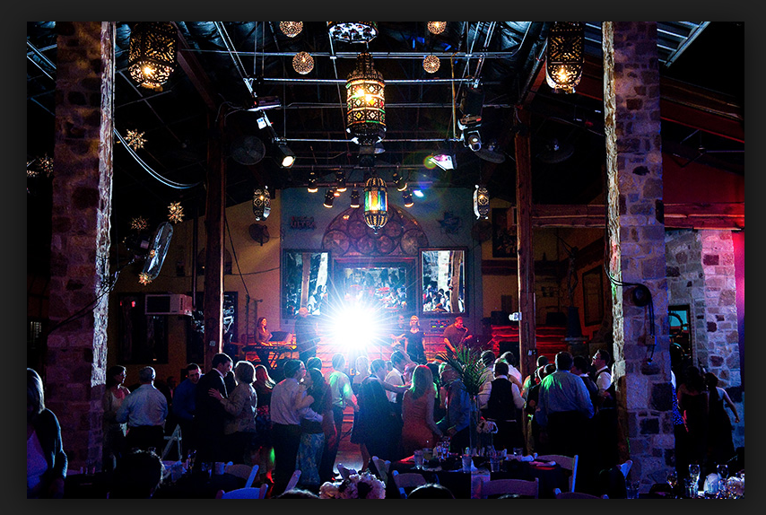
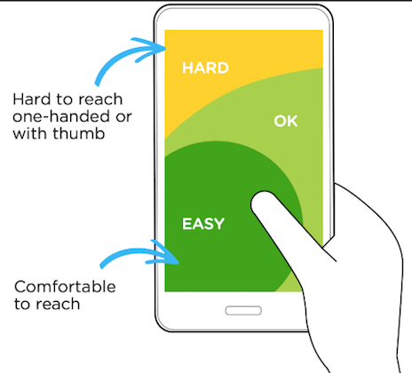
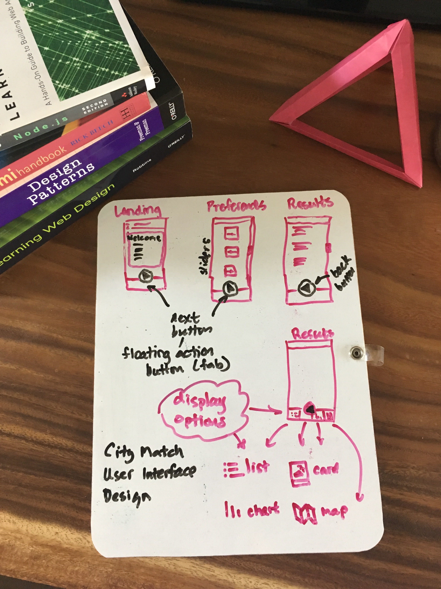
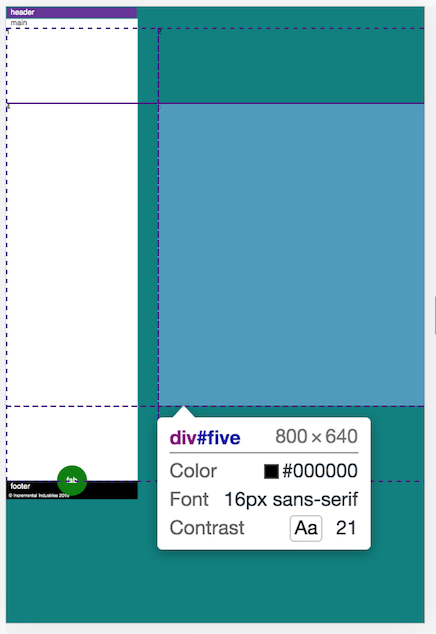
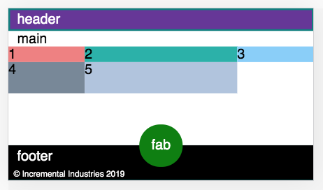
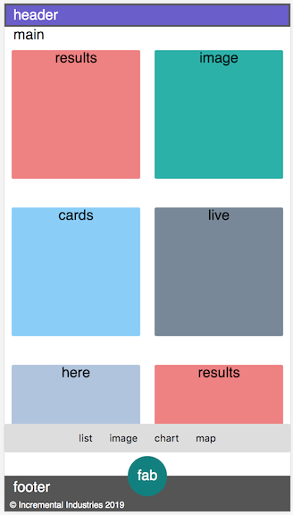

# City Match

Find your city.

# Designer's Log

The Starlight terrace at the Oasis is busy. It's Saturday night which means the music could be rock, soul funk, tribute or a mix. Tonight it's rock.

It's a varied demographic, mostly middle aged married couples getting their groove on with a mix of younger folk watching and enjoying the sunset.

And then he appears.

Early 30's, jean jacket, glasses, long hair, and a red bandana. He calibrates with the band, offering up some appreciative fist pumps to the middle-aged rockers. Later, he approaches the stage and holds up his Bic lighter high in appreciation.

I'm not sure what the band thinks of all this singular devotion. I'm guessing a flock of tipsy soccer mom's would be more their speed, but the point is, this guy has found his tribe and feels he belongs. And isn't that the bottom line?

## Big Data and the Search for Home

Sure, there are instrinsic qualities that allow us to feel comfortable in a variety of environments. But the external world still matters vitally. Scale, economics, culture, community all affect how we relate to and feel about a place. So in a world of options, can big-data help us find that viable place where we'll feel most at home given our resources?

[City Rank](https://github.com/zenglenn42/CityRank/blob/master/README.md), a 2-week software bootcamp project, explored that idea a bit. However there's only so much that can be done in such a short time.

City Match is an effort to realize the promise of City Rank by improving the user experience with thoughtful front-end design, hardening the code for better performance, and implementing some desired features.

## Thumb Ninja

My focus shifts from the stage to a nearby table where a woman whips out her phone and fluidly navigates through texts and images, powered by the grace of her thumb.

`Tap, tap, swish, scroll. Tap, tap, swish.`

There's an ease and comfort here that seem very natural. I want City Match to be that easy to navigate.

In the morning, I come up with this:

Three screens. A landing page, a preference page, and a results page, all thumb-navigable by a floating action button near the footer. The results page also features multiple views on the same data:

- list view
- image view
- chart view
- map view

On desktop, I could see offering more than one view at a time. But right now, I'm thinking about mobile mostly. That's the plan.

Even though playing with [Material Design components](https://getmdl.io/components/index.html) is a major goal of this UI redesign, I still want to make sure I understand some of the underlying layout tools offered by vanilla CSS (especially since MDL builds atop some of those tools).

## Flexy FAB Landing Page

Here's my first cut at a pure CSS floating action button centered about the footer edge. This is done with flexbox and absolute positioning and a sweet little calc expression to center the fab at (50% - 1/2 button width). With some SASS variabiles, I could make this more DRY.

I'll probably employ a media query to limit the max-size of the button on larger viewports, otherwise I get a truncated button. Not horrible, but also not great.

## Grid-based Preference Page

I'll employ some kind of responsive grid layout for the preference slider cards.

My first effort illustrates how grid geometries can easily spill over the available space:

I discover flex-ratio (fr) units and my grid-cells nicely fit to the viewport, preserving ratios:

But with the preference cards that host the sliders, I want something that collapses down to fit at least 1 card width on mobile platforms. I'm thinking auto-fit might be the key. Exploring that next.

## Not a Horrible CSS Grid

After much point, click, and cursing, I have a responsive grid. It also scrolls nicely within it's own div so the footer and fab button below that div always stay visible even with a lot of content.

Ruefully, I notice my slider cards often don't fall within thumb range with the current positioning. :-/ But I've burned my layout energy for the day and I'm ready to relax. CSS is an interesting goddess. She enables much, but you have to prove yourself worthy.

[Image](https://flic.kr/p/xWDRiU) courtesy Debansu Saha (by NC-SA-2.0 license).

Oh, btw, I've added some fu to get my fab button to shrink and grow in proportion to the viewport, but with size limiters at both extremes to keep things from getting ridiculous on retina or large displays.

## Grid-based Results Page

This is a wholesale grab of the preferences page for the content area, but I tuck a nifty flex row below it for buttons that will control the view on our results data. The buttons will morph to icons in time.

I also subtly tweaked the colors to go with my pastel motif. Not sure I'll keep these, but they are more pleasing than what I had above. I basically softened up the header, footer, and fab colors. It's all very Miami. :-)

The cool thing on mobile are the data format buttons. They're in the thumb-zone, so we have a nice usability win here.

Within the flex-ified button div, I use the option:

`justify-content: center;`

with a whisper of left/right button margin for accessibility and proximity to the floating action button (fab).
