# [City Match (demo)](https://zenglenn42.github.io/CityMatch/)

Find your city.

# Release 1.0 (MVP)

Still need to wire up the menus and info links, but basic city ranking and multi-view results work:

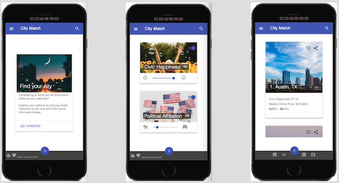
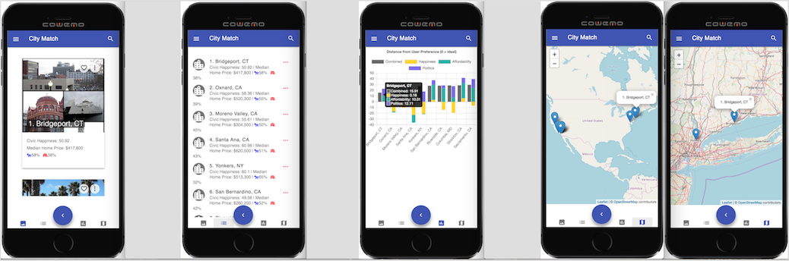

## Value Proposition

### User Value

Big-data can expand our awareness and help us find that viable place where we'll feel most enabled and at home given our resources.

### Monetary Value

Co-branding and demographic-driven advertising opportunities exist that would appeal to property management, real estate, and moving companies. Major regional employers and educational institutions could also find value in serving advertisements to prospective job-seekers and aspirational students looking to locate to an area.

# Designer's Log


The Starlight terrace at the Oasis is busy. It's Saturday night which means the music could be rock, soul funk, tribute or a mix. Tonight it's rock.

It's a varied demographic, mostly middle aged married couples getting their groove on with a mix of younger folk watching and enjoying the sunset.

And then he appears.

Early 30's, jean jacket, glasses, long hair, and a red bandana. He calibrates with the band, offering up some fist pumps to the middle-aged rockers.


Later, he approaches the stage and holds up his Bic lighter high in appreciation.

I'm not sure what the band thinks of all this singular devotion. I'm guessing a rush of tipsy cougars would be more their speed, but the point is, this guy has found his tribe and feels he belongs. And isn't that the bottom line?

## Big Data and the Search for Home

Sure, there are instrinsic qualities that allow us to feel comfortable in a variety of environments. But the external world still matters vitally. Scale, economics, culture, community all affect how we relate to and feel about a place. So in a world of options, can big-data expand our awareness and help us find that viable place where we'll feel most at home given our resources?

[City Rank](https://github.com/zenglenn42/CityRank/blob/master/README.md), a 2-week software bootcamp project, explored that idea a bit. However there's only so much that can be done in such a short time.

City Match is an effort to realize the promise of City Rank by improving the user experience with thoughtful front-end design, hardening the code for better performance, and implementing some desired features.

## Thumb Ninja

My focus shifts from the stage to a nearby table where a woman whips out her phone and fluidly navigates through texts and images, powered by the grace of her thumb.

`Tap, tap, swish, scroll. Tap, tap, swish.`

There's an ease and comfort here that seem very natural. I want City Match to be that easy to navigate.


In the morning, I come up with this:


Three screens:

- landing page
- preference page
- results page

all thumb-navigable by a floating action button near the footer. The results page also features multiple views on the same data:

- list view
- image view
- chart view
- map view

On desktop, I could see offering more than one view at a time. But right now, I'm thinking about mobile mostly. That's the plan.

Even though playing with [Material Design components](https://getmdl.io/components/index.html) is a major goal of this UI redesign, I still want to make sure I understand some of the underlying layout tools offered by modern CSS (especially since MDL builds atop some of those tools).

## Flexy FAB Landing Page

Here's my first cut at a pure CSS floating action button centered about the footer edge. This is done with flexbox (to flex the main section and yield a sticky footer), absolute positioning, and a sweet little calc expression to horizontally center the fab at (50% - 1/2 button width). With some SASS variables, I could make this more [DRY](https://en.wikipedia.org/wiki/Don%27t_repeat_yourself).

I'll probably employ a media query to limit the max-size of the button on larger viewports, otherwise I get a truncated button. Not horrible, but also not great.


## Grid-based Preference Page

I'll employ some kind of responsive grid layout for the preference slider cards.

My first effort illustrates how grid geometries can easily spill over the available space:


I discover flex-ratio (fr) units and my grid-cells nicely fit to the viewport, preserving ratios:


But with the preference cards that host the sliders, I want something that collapses down to fit at least 1 card width on mobile platforms. I'm thinking auto-fit might be the key. Exploring that next.

## Not a Horrible CSS Grid

After much point, click, and cursing, I have a responsive grid. It also scrolls nicely within its own div so the footer and fab button below that div always stay visible even with a lot of content.


Ruefully, I notice my slider cards often don't fall within thumb range with the current positioning. :-/ But I've burned my layout energy for the day and I'm ready to relax. CSS is an interesting goddess. She enables much, but you have to prove yourself worthy.


[Image](https://flic.kr/p/xWDRiU) courtesy Debansu Saha (by NC-SA-2.0 license).

Oh, btw, I've add some fu to get my fab button to shrink and grow in proportion to the viewport, but with size limiters at both extremes to keep things from getting ridiculous on retina or large displays or smaller devices. City Match on iWatch some day?

## Grid-based Results Page

This is a wholesale grab of the preferences page for the content area, but I tuck a nifty flex row below it for buttons that will control the view on our results data. The buttons will morph to icons in time.

I also subtly tweak the colors to go with my pastel motif. Not sure I'll keep these, but they are more pleasing than what I have above. I basically soften up the header, footer, and fab colors. It's all very Miami. :-)


The cool thing on mobile are the data format buttons. They're in the thumb-zone, so we have a nice usability win here.

Within the flex-ified button div, I use the option:

`justify-content: center;`

with a whisper of left/right button margin for accessibility and proximity to the floating action button (fab).

The layout and styling could use some polish. For example, I feel the button bar cries out for a top-bar of some sort to keep the balance. And maybe that space between the button bar and footer is a slightly odd dead-zone. Could I wedge some monetization in there without be annoying? I could see stacking those two bars and having the fab push the middle option buttons to either side. But I feel I'm in the good enough category at the moment and I want to get some Material Design going and to get this thing /wired up/ to the backend.

The other cool thing is I have more than just wireframes here. I have actual code and behavior that is responsive thanks to the super powers for flexbox and grid. So I could easily hand this off to an awesome designer for them to riff-on and evolve so it's inviting and chock full of [affordance](https://sites.google.com/site/thedesignofeverydaythings/home/affordances).


Photo by Reynaldo Brigantty (#brigworkz)

## Material Design Lite in the House

Here's my first pass at an MDL-based landing page on mobile.

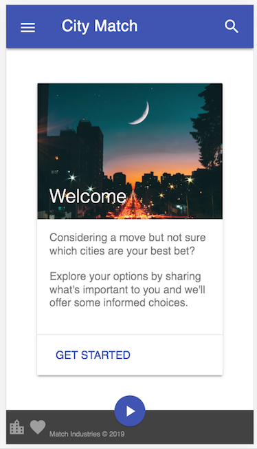

I may switch out the picture for something sunnier, but there are several things I like about the image:

- It's charming!

  - The star filter on the street lights and framing of the crescent moon are almost whimsical.
  - The time-lapse river of orange and yellow is lovely and vibrant.

- The image is not identifiable with any /specific/ city.

  - I want something suggestive that doesn't show bias for a particular city in the landing.
  - That, or have a montage kind of thing of several cities. Possibly a tasteful carousel if it's not too busy.

- [Image](https://www.pinterest.com/pin/742179213570198708/) is courtesy [imageocra](https://www.pinterest.com/imageorca/)

MDL has opinions about stuff ... like color. I'm trying to avoid a bunch of custom colors and simply rely upon defaults like 'primary' for nav bar and fab.

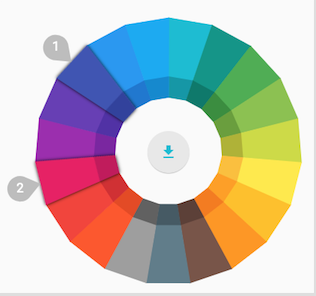

Do you notice the footer, by default, is not solid black? Looks like my instinct to lighten my pure CSS footer above aligns with MDL's default sensibilities.


Image courtesy Beto Franklin.

I wake up this morning with a solution for the results page 'dead-zone' under the view buttons. Just stick to my original design on mobile of morphing the footer into a bottom-app bar and let the buttons live in the sticky footer area. Much more pattern-ful, I think. On desktop, I could see having a dedicated results area that floats above the footer and /contains/ the button bar giving better locality of task for larger displays. I'll try to make that happen with some media queries.

The 'list', 'image', 'chart', and 'map' buttons become icons adjacent to the fab on mobile, eliminating that odd dead-space between the gray button-bar and footer on the left.

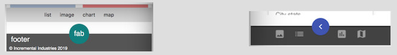

For now, I want to get the MDL-based preference page cleaned up and doc'd. I'm really enjoying this design exercise probably because it engages very different parts of my brain than my coding-brain. I'm learning a visual vocabulary and getting better at expressing what's in my mind's eye with CSS.

I notice my repo is starting to get cloned, so others must be interested in my exploration as well. (-;

## MDL-based Preferences Page

MDL has a clean look and I'm trying not to clutter it up with background images behind my cards.

Here's the preference 'slider' page. The switches at the bottom of the cards enable & disable preferences users don't care about.

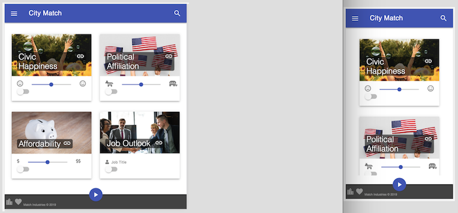

I'll probably add a 'guidance' card at the top that simply invites users to select their preferences. This will provide context and enhance usability by pushing the other sliders closer to the thumb region.

Notice on mobile how the preference card subtly disappears /before/ it hits the floating action button? I think it looks better than tucking behind the button and footer and reduces chance of fat-finger hits between slider and fab button.

Maybe with offscreen preferences (especially on mobile), the 'next' button will remain gray and inactive (or even hidden) until the user scrolls all the way to the bottom of the content just so they don't miss any options before triggering the results pages. If the user disables all the preference cards, the 'next' button should be hidden since there is no sense in proceeding to a results page without ranking criteria.

💡It would be easy enough to add a filter for limiting the search to specific states:

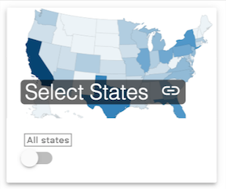

With the scrollable preference window, the app scales to an endless array of selectable options. For minimal viable product (MVP), I'll stick to the 4 preferences I have above. Once the VC clears, all sorts of scalability plays can happen. (-;

## MDL-based Results Page

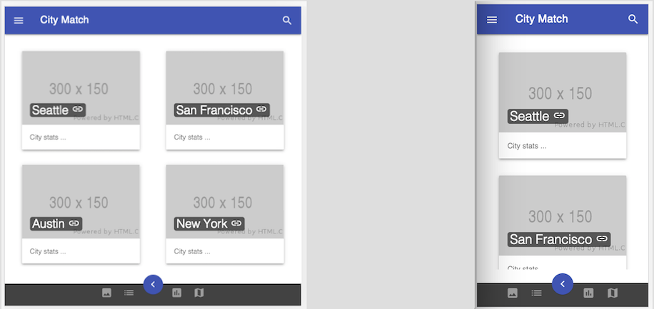

I mock up some results cards and implement the view buttons in the bottom app-bar. I may add text for them as well. I'm using a spacer-button with 'visibility: hidden' in the middle to 'push' the other view buttons away from the floating action button.

I also figure out how to customize the primary and secondary colors on the [MDL site](https://getmdl.io/customize/index.html). So I could come up with more of a teal-based look to match the teal tones in the landing page.

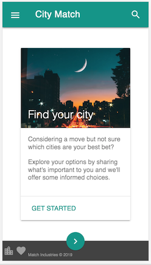

This thing is looking real.


## Onto the Controller

I need to bring up a controller that listens for button clicks and switches page views. But I'm blocked. My mojo is just not here today. I've been working at this pretty hard for the past week and I need a break. The UI design is in good shape and with fresh eyes, I'm hopeful the controller will emerge in the fullness of time.

## Turning the Page


Photo by Pixabay

I've come to a decision on my HTML. This is a relatively small app from a front-end perspective and I could just inline all 3 pages worth of HTML and maybe do the whole jQuery _.hide() / _.show() thing for each page-level div.

But there is a /lot/ of repetition in the markup with MDL cards that only differ in a few attributes. Seems a safe bet to either use templates or programmatically generate the content with parameterized helper functions.
In fact, this is essential for scalability of preference options and dynamically generated results.

Though I want to improve my vanilla javascript chops, I think I will lean on my frenemy, jQuery, since he has some ready idioms for enabling event delegation to dynamically created DOM children with buttons and sliders and such. Maybe as a-post MVP exercise, I may redo this in pure js since I know it's good for me.

With that decision out of the way, I can focus on the primitives I'll need to build out the HTML dynamically.


Photo by Tim Gouw

Ok, that was not bad at all. My HTML is [dynamic](https://github.com/zenglenn42/CityMatch/blob/a1c9c0ffeb00ef0bb0e6165ea914a683f56984b5/assets/js/controller.js#L2). That means the body of my html is blissfully uncluttered:

```
  <body>
    <div
      id="body-div"
      class="mdl-layout mdl-js-layout mdl-layout--fixed-header"
    >
      <!-- programmatically add content here -->
    </div>

    <script type="text/javascript">
      controller = new Controller("body-div");
    </script>
  </body>
```

I'm getting an intuitive sense of how libraries like React emerge given aggregation of markup and behavior in the controller now.

Now I need to wire up the buttons.

But before that, a non-linear thought from a previous conversation wells up.

## Monetization

Could this thing generate ad revenue?

I'm thinking about:

- Movers
- Realtors
- Apartment locators
- Job recruiters
- Major employers
- Educational institutions

With some stylistic guidelines, such monetization cards could be blended into the output without looking horrible:

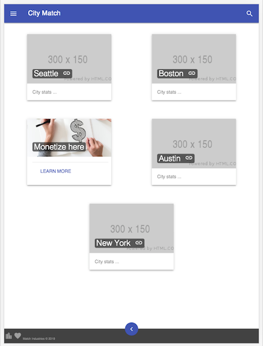

More subtly, the monetization cards could be auctioned off in real-time, calibrated to the demographic data implied by the user's preferences, particularly affordability. Is that evil or brilliant? [Discuss](https://en.wikipedia.org/wiki/Coffee_Talk).

I need to get this thing generating hit metrics if I go down that path.

Beyond that, I fix a few regressions caused by my flurry of coding yesterday in the rush toward dynamic HTML.
I also wire up the fab buttons and deploy to [github-pages](https://zenglenn42.github.io/CityMatch/) so you can at least advance the prototype between landing, preferences, and results pages (though I see my fancy enable checkboxes on pref cards have reverted to simple checkboxes and the hamburger menu only works on the landing page, bah). Overall, it has been a good day.

## Dynamic HTML decorated with MDL classes is a Thing


Photo by Tim Mossholder

I'm still dealing with the fallout from generating my HTML on the fly with javascript. Strangely, event delegation to the hamburger menu works for my first dynamically created page, but fails for subsequent pages. In plain English, the menu doesn't do anything when I click on it for the preference and results pages.

The other issue is my spiffy MDL-styled checkboxes are no longer styled. And even more annoying, the active region for the unstyled checkbox extends for the length of the card,
creating all sorts of opportunities for trying to tap the slider but getting the enable /
disable toggle.

So I need to slow down and fix stuff and maybe actually read the docs on [dynamic MDL](https://getmdl.io/started/index.html#dynamic). :-/

### Unpacking MDL Switches

So I want this MDL-styled switch on my preference cards:


but I'm getting /this/:

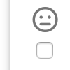

And sure enough, if you look at the underlying HTML, you see:

```
<label class="mdl-switch mdl-js-switch mdl-js-ripple-effect" for="switch-civic-happiness">
  <input type="checkbox" id="switch-civic-happiness" class="mdl-switch__input">
</label>
```

whereas on a properly formed MDL switch, you should see:

```
<label
  class="mdl-switch mdl-js-switch mdl-js-ripple-effect mdl-js-ripple-effect--ignore-events is-upgraded"
  for="switch-civic-happiness"
  data-upgraded=",MaterialSwitch,MaterialRipple"
>
  <input type="checkbox" id="switch-civic-happiness" class="mdl-switch__input"/>
  <div class="mdl-switch__track"></div>
  <div class="mdl-switch__thumb">
    <span class="mdl-switch__focus-helper"></span>
  </div>
  <span
    class="mdl-switch__ripple-container mdl-js-ripple-effect mdl-ripple--center"
    data-upgraded=",MaterialRipple"
    ><span class="mdl-ripple"></span></span>
</label>
```

All that missing HTML is normally added behind the scenes by MDL's javascript when the abstract representation of the HTML is loaded into the document object model (DOM).

However, with dynamically generated HTML, I'm downstream of any "document-loaded" event and am missing out on that essential MDL "upgrade" that happens to the stock checkbox HTML.

Fortunately, MDL provides a utility function for this case:

```
componentHandler.upgradeElement(checkbox);
```

The usage pattern is more like this:

```
/* DOM already loaded.  About to create dynamically generated checkbox. */

let checkbox = createCheckbox(id, isChecked);
checkbox.setAttribute("class", "mdl-switch__input");

/* Enhance checkbox with MDL-styling. */
componentHandler.upgradeElement(checkbox);
```

Now my dynamically-generated preference cards feature MDL-styled enable switches like they used to when the HTML was static:

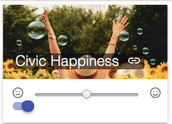

As with most things in life, the [actual fix](https://github.com/zenglenn42/CityMatch/commit/fd5a32d5ac4b09d9bb6a3467424ec1041fb8771e#diff-453a0b065c3a1e8636126a44b38d9f55R35) is a little more involved than what has been advertised. He who carries the bag, knows what's inside.

### [Fix IT!](https://tenor.com/view/fix-it-snl-oscar-rogers-weekend-update-kenan-thompson-gif-10667500) (the unresponsive hamburger menu)

I jump into the chrome debugger and bring up sources and enable mouse-click event listener breakpoints, hoping that will give me a meaty clue in the working case of which method /should/ be firing and leverage that to search the web.

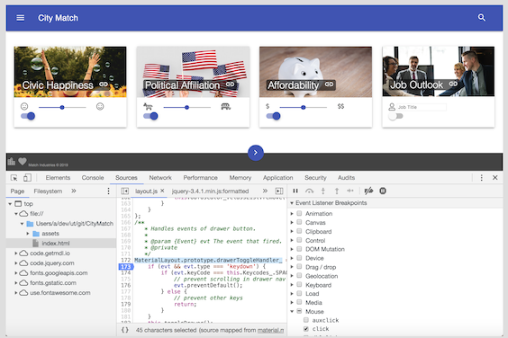

```
MaterialLayout.prototype.drawerToggleHandler_ = function(evt) {...}
```

Ah, the toggle handler fires on the landing page, but /not/ preferences and results pages.
The gift economy of [stackoverflow](https://stackoverflow.com/questions/35672757/dynamically-adding-mdl-nav-drawer) comes through for me thanks to Krishna Santosh Nidri. I'm rewarded with I nice slideout menu:

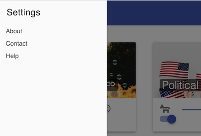

It can be styled later.

With this [fix](https://github.com/zenglenn42/CityMatch/commit/9d0e6c28ac27b1b4ca5e3c412f5bbbe4a96b01e5) in place, serenity is restored and I can think about adding event listeners to other user-interaction elements.


Photo by Simon Migaj

## [Machine Learning](https://work.caltech.edu/telecourse) Play?

I've watched friends and family play with City Rank and in some cases they're delighted. "Oh, I /do/ like that city!" And in other cases, not so much. "That town is a stretch for me."

Obviously there is complexity in what matters to someone. The current preference sliders (happiness index, political affiliation, affordability) are interesting and help narrow the field, but it would be difficult to anticipate all the inputs that matter. (One mom wanted a city with driveways that were not too steep. :-/)


Photo by Pixabay

My question: Is there a way to tap into the collective wisdom (or more darkly, the biases) of the crowd by adding a 'like' button on each city card in the results section, essentially capturing preference data not anticipated by the finite number of input preferences? Out of this set of 10 results, humanity tends to favor /this/ subset ... kinda thing.

Such preference data would certainly help with monetization and ad targeting.

Obviously ML is probably not for MVP, but something in the back of my mind. The 'like' ♥ button, on the other hand, is low hanging fruit.

## Shades of Gray

On the preference page, it would be nice if the image grayed out when the slider switch for that card is disabled. So I make that happen:

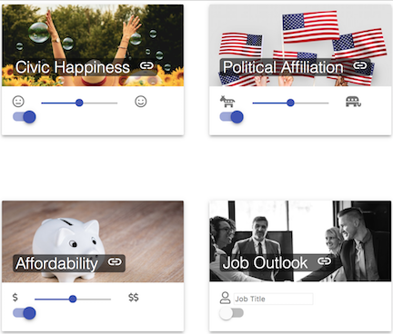

Ultimately, this setting should be conveyed to the model (by the controller) so this particular preference parameter is factored out of the city rank calculation.

Gray is the new gray.


Photo by Pixabay

## Clean and DRY

Man, I need to clean up around here.

I start by standardizing some of my function [naming](https://github.com/zenglenn42/CityMatch/commit/497f3ae3839d1a380e18cd88a08f36dd5dece9ae). The controller code is coming along nicely but a bunch of it is hanging outside the controller object itself. So I [fix](https://github.com/zenglenn42/CityMatch/commit/8a7e1fcb0a9082c38cc85aeac3dde39647094a58) that. I make the [code](https://github.com/zenglenn42/CityMatch/commit/37dd5fdfb057d3450d3d37e6a0a07ca61c7b393b) a bit more DRY by generalizing the callbacks for the 'next' button. I also kill some duplicate [code](https://github.com/zenglenn42/CityMatch/commit/f86ec0e751ad2bb18eacea240a700c71967f8118) for generating the nav bar.


Photo by Mali Maeder

I also move the preference on-off switch into the image area to minimize fat-finger interactions between it and the traditional slider. I think it also enhances affordance since the switch is now closer to the image which is subject to grayscaling when the "lights are turned off" and the preference disabled.


I'm also now listening to slider change events. And now the controller can serve up preference json to the backend:


## Wire-up the Backend


Photo by ViTalko

After a flurry of [coding](https://github.com/zenglenn42/CityMatch/commit/d5b36711abf409913104c944c7140630607c10b1) and [debugging](https://github.com/zenglenn42/CityMatch/commit/a63ceae5b5822fd28110ec308967a543fac4a84a), the model is now ranking cities for the controller. (-;

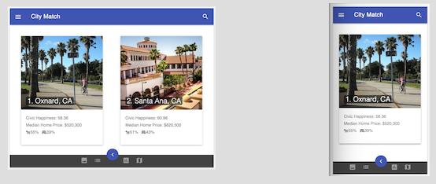

I still need to make model-ranking ignore disabled preferences (and maybe add a modal for requiring at least one specified preference). For now, the model data is simply static and enhanced from City Rank (which was more ajaxy and leveraged firebase to standup a data endpoint).

## Usability Reality Check

Software is hard.


Photo by Nathan Cowley

Two hours ago, I was flush with exhilaration to see city cards with actual images pop-up in my swank-ified dev environment.

But when I get to mobile and try actually hitting the deployed site, I sense a disturbance in the force. This is /not/ acceptable for someone of my [midi-coderian](https://starwars.fandom.com/wiki/Midi-chlorian) level. Here's what bugs me:

1. The fab button is [too small](https://github.com/zenglenn42/CityMatch/commit/c47c793f1bc206acfb27906d22ca4f026ab79bf4) on mobile.
2. The view-format buttons need to be [spread out more](https://github.com/zenglenn42/CityMatch/commit/c47c793f1bc206acfb27906d22ca4f026ab79bf4).
3. The fab button is too dark. I totally need to get the [teal](https://github.com/zenglenn42/CityMatch/commit/8af03b872a68c2a3d73c838bca398ced27caca65) thing going.
4. The sliders are /hard/ to work with. They are just too [short](https://github.com/zenglenn42/CityMatch/commit/36792ce6e3a64d5290b3b88bbf68c66197fff831) and small on mobile and I get no sense of state change as I move the [thumb element](https://mdbootstrap.com/support/general/making-the-slider-thumb-more-mobile-friendly/) left or right. I mean, I love the sliders, but really. Where is my [CSS light sabre](https://github.com/zenglenn42/CityMatch/commit/803296dc1d646ccd7166eeaa18ae3ce62e7c84e3)?
5. Oh, and I really need to [add back monetization cards](https://github.com/zenglenn42/CityMatch/commit/baf8bae83881559fcee6833fa7d2603189cc392f) in the results.

Ok, feeling much better about the state of things.


It has been a /very/ good day.

## Ignoring Disabled Preferences

The app is looking more polished so it's getting a lot more testing and visibility from friends and family. One discerning tester understood the intent behind the preference card 'light' switch and tried disabling all the preferences and still got results.

I confess that feature is only implemented on the front-end. With this [commit](https://github.com/zenglenn42/CityMatch/commit/19c5c52aa22024dfd5bc05e366a2d5a77611f40d), I make it work for the backend ranking algorithm too.

Enabling just 'civic happiness' yields Plano, Texas (as expected according to the underlying study used).

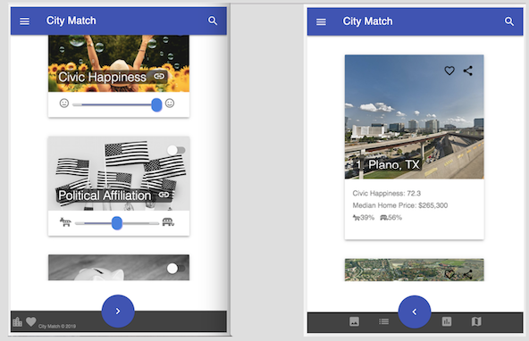

For now, if all preferences are disabled, you still advance to the results page, but get a nice message:

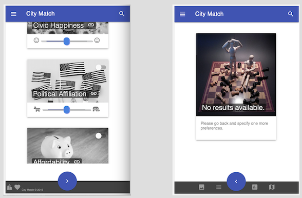

I may tweak the usability around this, but it's good enough to ship.

## Before and After

Here's a contrasting reveal with the bootstrappy-ui of City Rank:


## Next Steps


I think I'm going to take a break from this for a little bit. When I come back, I'll likely work on:

- view formats
  - list, chart, map
- live lists
- [elastic search](https://www.elastic.co/products/elasticsearch)
- menus
- job outlook
- react anyone?

## Sad Face :-/

Huh, it looks like some of the URLs for city images I use are /changing/ from under me:

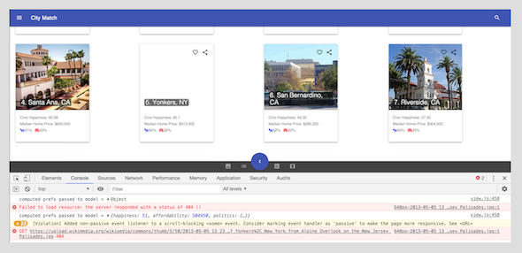

I manually audit these and [fix](https://github.com/zenglenn42/CityMatch/commit/7faea10d138dafd59c2efc1aec26615c7fa78fe9) several. But this suggests I might need to tuck these away within the app for better reliability. That, or periodically test these URLs as part of a build process.

## [Zeigarnik](https://en.wikipedia.org/wiki/Zeigarnik_effect) Whispers


Something's not quite right with the pattern.

It takes a while to distill it down to something conscious and actionable.
MVC, M.. V.. C.., MV -- wait. I have no V! The view all got sucked out of the html and into my controller, my C, when I made the html-generation dynamic.

Maybe that's the way of things, but it just doesn't sit right with me. I want this to be unmuddled, to clearly see important dependencies and relationships in the code relative to this abstraction I hold in my mind. Besides, my controller module is pretty big. While I'm at it, I'm gonna move that big honkin' piece of static model data into it's own object and declutter the model a bit. Maybe sweep up some hardcodes while I'm at it.

So yeah, another round of code refactoring yields this [fix](https://github.com/zenglenn42/CityMatch/commit/a73501315c1438e4eb5ab7012086eec368b502ce).

The controller clearly aggregates the model and view, helping the two to communicate. In some places, I push some callbacks into the view constructor from both the model and controller so the view can come to life and report results nicely. But now, those relationships are clearly spelled out in the constructor, rather than lurking below in a sea of code, waiting to trip-up some poor sustainer who has to maintain or evolve this endeavor.

```
function Controller(bodyDivId) {
  this.model = new Model();

  this.view = new View(
    bodyDivId,
    this.getLandingPageEventListeners().bind(this),
    this.getPreferencesPageEventListeners().bind(this),
    this.getResultsPageEventListeners().bind(this),
    this.getNextButtonEventListener().bind(this),
    this.model.getCityRankCB().bind(this.model),
    this.model.getMinHappinessValue(),
    this.model.getMidHappinessValue(),
    this.model.getMaxHappinessValue(),
    this.model.getMinAffordabilityValue(),
    this.model.getMidAffordabilityValue(),
    this.model.getMaxAffordabilityValue(),
    this.model.getMidPoliticsValue(),
    this.model.githubUrl
  );
  this.view.createLandingBody();
}
```

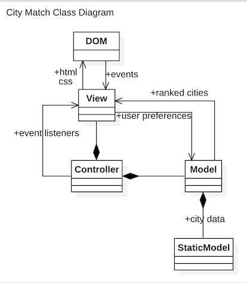

Sometimes the toughest work you do has no immediate appearance to the outside world.


## So long, jQuery


You're very useful, but I'm headed for [React](https://reactjs.org/) and avoiding other libraries that manipulate the DOM should simplify adoption. Here's the [fix](https://github.com/zenglenn42/CityMatch/commit/eb5427c83449a03fc1973792d2e4b2fa7a4ec580) that removes that dependency.

## Tab-i-fied Buttons

MDL provides some nice usability with their components. One day, the buttons at the bottom of the results page will mean something. So I get ready for that by [making](https://github.com/zenglenn42/CityMatch/commit/8270a2fb619be302541a5a38e91e2904e8600ba9) the buttons clickable tabs.


## Usability Kindness

Sometimes the little things matter. I had slapped an aspirational 'like' and 'share' button on the results cards, but they were disappearing against darker or busy background images, requiring jedi skills of the user to find.

I fix it with an expedient in-line style (bad, I know, but great for quick riff'ing :).

```
style="background: rgba(255,255,255,.8);"
```

Now we have uniform visibility across result cards, contributing to a subtle but overall feel of comfort:


You can see I've also opted for the more scalable '3 dots - more' button to meet requirements not yet known without cluttering the card too much.

Also, I [improve](https://github.com/zenglenn42/CityMatch/commit/7066b27290959aa91358a90550eedde1bac366e2) indication of the active view button in the results page with color styling.
On the right, I use the primary color (indigo) and gray for the inactive buttons (since the MDL tab indicator was getting cut off and too subtle for bottom-app-bar applications).


## List View

I get list view working, since it's relatively low hanging fruit. The data is the same as for chart view, minus the image url. So I just need to throw it into an html list, created dynamically.

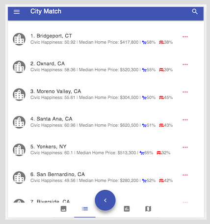

It still needs some tweaking on mobile, but it's good enough to demo.
I'm looking forward to chart and map view, but they will require 3rd party libraries.

## Chart View

I'm on a roll, knocking out a basic grouped stacked bar chart using Chart.js. It has nice animation and is super simple to integrate, thanks to some Array.map fu. I'm not sure how many user's will actually be interested in this view, but quants probably will appreciate. Basically, the ideal city will have a distance of 0 from the user-preference point.

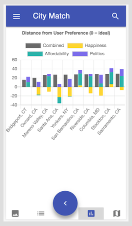

I also get a nice metrics pop-up for free:

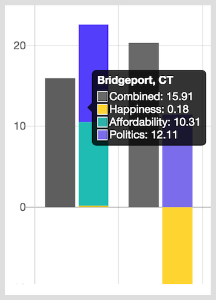

This just scratches the surface for visualization. A graph like [this](https://bl.ocks.org/mbostock/1062288) might be interesting to explore. Perhaps it could provide another view on how cities relate to each other.

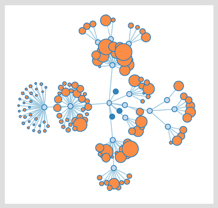

## Full Stack?


So is this a full-stack application? No, not really. The model data are produced off-line and provided as a simple [array](https://github.com/zenglenn42/CityMatch/blob/2f307a1f800bd1b547e6dba6e30754cfdd93046b/assets/js/static-model.js#L12) of city metric objects. Other than serving up a [file](https://github.com/zenglenn42/CityMatch/blob/master/assets/js/static-model.js) to the client, the (github-pages) server has little to do.

I don't feel too badly about this since the point here is to explore and evolve the user experience (UX) from City Rank days as opposed to developing a ruggedized data pump to the backend. To that end, I'm adding geo-location data for each city into the static model so I can rollout 'map-view'. Localizing the data endpoint to the client means we'll also get super fast performance after initial data load and can play with features like 'live-list' which should allows me to mutate the ranked list in real-time. It also means I don't have to really think about quota limits against my key if I were to inject it into the normal backend operation of the app. These city locations are not changing anytime soon so this one-shot approach suits my purposes, though adding new cities is a thing.

If you want to see more generalized backend work, checkout the model in [City Rank](https://github.com/zenglenn42/CityRank/blob/master/docs/images/uml-cityrank-cd.png). I play with ajax and firebase there for persisting data.


I basically make ~200 synchronous calls to Google's geocode endpoint, passing in just the city and state as the address and getting back latitude and longitude.

```
// Code courtesy: https://tinyurl.com/yymbb95e with modifications.

StaticModel.prototype.ajaxGetLocationCoordinate = function(address) {
  var position = {};
  $.ajax({
    url: "https://maps.google.com/maps/api/geocode/json",
    type: "GET",
    data: {
      address: address,
      sensor: false,
      region: "US", // regions string is from:
      // http://www.iana.org/assignments/language-subtag-registry/language-subtag-registry
      key: "Your_API_Key_Here"
    },
    async: false,
    success: function(result) {
      // console.log(result);
      try {
        position.lat = result.results[0].geometry.location.lat;
        position.lng = result.results[0].geometry.location.lng;
      } catch (err) {
        position = null;
      }
    }
  });
  return position;
};
```

I wonder if Google will throttle my requests or only return the first n-cities worth of data, but I kick off my utility program and patiently wait a full minute and am finally [rewarded](https://github.com/zenglenn42/CityMatch/commit/2d00b08b00348179a7bfc8a5cd6167009e3705d6) with all the data I need for the model. :-)

## Map-View


Okay, markers on a map. That's the objective. I have a few options. I could just go with The Google and do some map markers, especially for MVP. I'm also thinking it would be fun to play with [D3](https://d3js.org/) a bit. I start looking around and hit this interesting [thread](https://medium.com/@PepsRyuu/why-i-no-longer-use-d3-js-b8288f306c9a). It places D3 in historical context and advocates, with nuance, for considering other [approaches](https://preactjs.com/) that leverage virtual DOMs and low-impedance syntax of React.

I may still do the D3 thing just because it's prevalent and good for my vocabulary. Is it the jQuery of visualization, though? Not ready to say that.

(⌛time passes ...)

Hah! Went with a basic solution with [leaflet](https://leafletjs.com/).

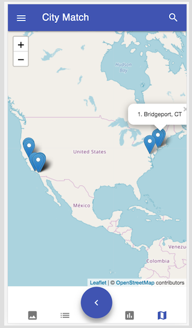
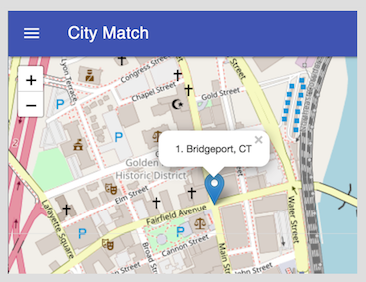

This could use a lot of polish, but I've got markers on a map. And you can zoom into the street level and don't need to stress over api keys (since it's based upon [open street maps](https://www.openstreetmap.org/#map=3/38.00/-95.80)).

So yeah, all four views work: image, list, chart, map.


The results code could use some refactor, but I think I'll bump this up to 1.0 MVP.


## Small Planet

You know, inclusion of latitude and longitude in the model and the rollout of map view open up some very compelling possibilities.


I can see swooping down from a high-level map view to something like Google's street view for a much more immersive sense of a place.

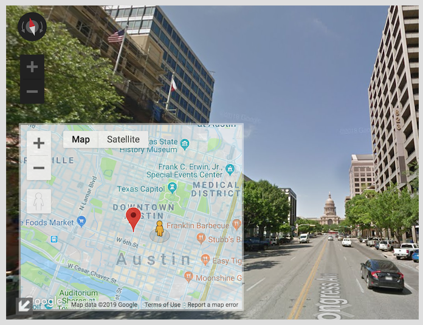

Subject to [terms of use](https://www.google.com/intl/en-US_US/help/terms_maps/), you could even do a fly-by of a city with [Google Earth](https://www.google.com/earth/). Google exposes an [earth engine API](https://earthengine.google.com/), so this kind of integration seems doable (perhaps with even more sophisticated preferences possible now for extreme weather conditions or fire and flooding). You could organize fly-bys of the top 10 cities /including/ mini fly-bys of the cities themselves. You'd probably want to curate a list of proximate city features and chamber of commerce highlights.

Google has monetized many of their APIs so I'd probably save a feature like this for a fullstack implementation where I have a better shot at protecting the api key, and maybe unlocking that feature for user's who have established an account or otherwise subscribed.

I'm thinking of a business model closer to 'Consumer Reports' and their in-depth auto reports which include valuable pricing information. You get some data for free, but for premium content, you have to pay. With other business models, user's trade some of their data for access. It's interesting be on the other side of the data equation, because I hate being commoditized. At a minimum, the choices for the user should be transparent and clearly rationalized.

## Agile and the Dalai Lama?

One of the tenets of Agile software development is an emphasis of communication over documentation. This means you don't isolate yourself in some ivory tower, writing beautiful requirements documents for some ethereal customer and their imagined needs, only to descend with some lovingly crafted but largely irrelevant direction.

Instead, you talk with people. A lot. You involve customers or potential customers early in the process and frequently demo your progress so you can check your trajectory and value against actually expressed needs and requirements.

So I'm doing that, facilitated by a responsive design that is easy to demo from my cell phone. Usually the response to my impromptu demos ranges from politely neutral to strongly enthusiastic.

Until last week.

"This is dumb. I don't like this," she says flatly.

Sometimes you don't hit it off with someone because the solution you're proposing is just not relevant to your bystander beta tester. I get that. But this person was actually /interested/ in finding a new place to live in the near future. Perfect scenario for me, really.

"Why do I care if someone who lives next to me is happy or not? Why do I care about their politics?", she continues undeterred.

I tamp down an initial pang of vulnerability and laugh. I try to explain she can disable the preference cards that don't apply to her. She plays disinterestedly with the affordability slider and reviews a few cities that seem to past muster at some minimal level. But she is unimpressed.

So I ask, "How /are/ you going about figuring out where to move? What's important to you?"

- Pricing is important.
- Focussing her energy on areas she has already vetted is important.
- Access to Zillo-related property searches is important.
- Proximity to natural beauty is important.

The feedback is interesting, I think. Some of it relates to ideas I've already kicked around. Filtering by region or state makes a lot of sense since people already bring an unspoken collection of 'pre-set' preference sliders to the table and already have a sense of what is desired. Tie-ins to real estate or apartment management portals have been on my radar, etc.

Generalizing things and bit, and riff'ing on what I'm learning about React and it's pluggable component-view of the world, I can imagine an endpoint with a variety of downloadable, plugable preference cards that come not only with a componentized view, but with a componentized /model/.
Someone has done the hard work of chasing down the endpoints, supplying the keys that make the data flow, and characterizing that data, all verticalized for my City Match-centric universe :D. (I mean CM /is/ the new FB, right? You didn't know.)

A specification could be defined that makes 3rd party originators and publishers of City Match preference add-ons possible. I suppose every app-store wannabe has had fantasies of that kind of scalability. It's where my brain goes and it's fun to dream ... a tailored data-as-a-service thing. I mean, that's what endpoints /are/ and every backend devised is really just quietly doing this every day for their corresponding programs and applications.

But I'm taking the added step of associating that data somehow with a downloadable jsx-ified view component. If you could cultivate a garden of these things, then maybe folks like my discriminating beta tester might find the preference cards that really matter to them rather than me trying to anticipate what will work for everybody.

Where does the Dalai Lama come into all of this?

Last night, while driving home from my fullstack bootcamp, I listen to an [interview](https://www.intelligencesquaredus.org/news/blog/iq2-interview-should-you-love-your-enemies) between John Donvan of Intelligence Squared fame and Arthur Brooks, discussing Brooks' new book, "Love Your Enemies: How Decent People Can Save America from the Culture of Contempt".

Brooks knows and has co-authored books with the Dalai Lama. At one point, Brooks asks his exalted friend, "How should I respond when contempt is directed toward me?" "With a warm heart," is the response. It's a glimmering insight from someone who is no stranger to attack. Brooks then relates, in the interview, some of the physiological benefits that flow to body and enhance well-being if we can do this in the face of perceived negativity.


It's simple advice which runs counter to our normal instinct to be defensive in the face of unexpected or contrary feedback. But if you're going to embrace agile software development, this strategy may be useful if difficult to master.
